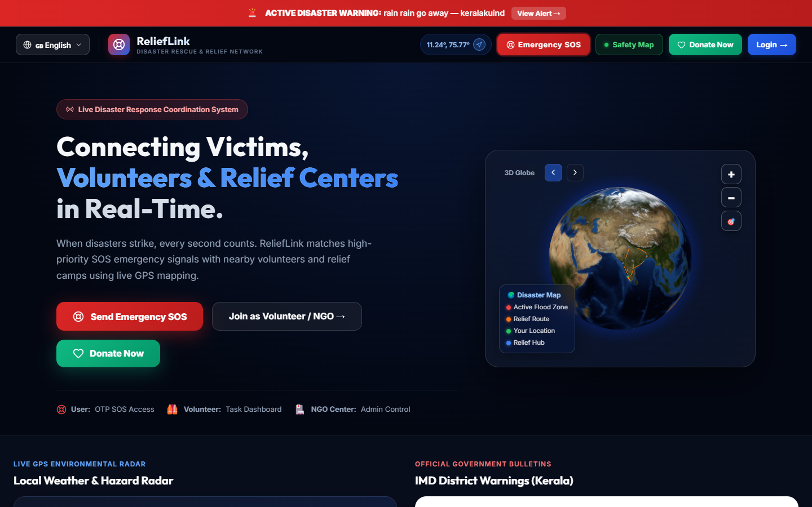
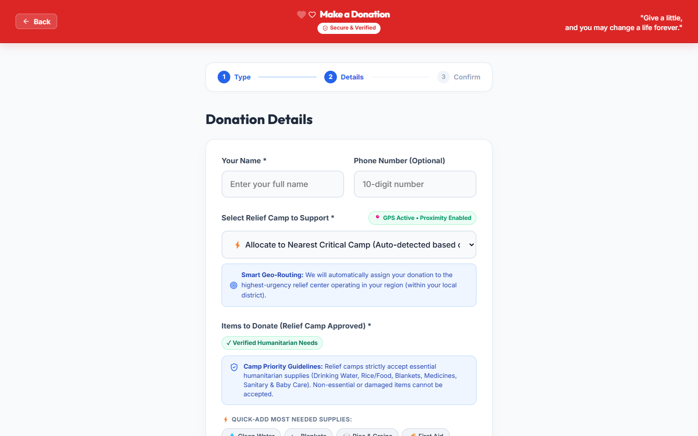
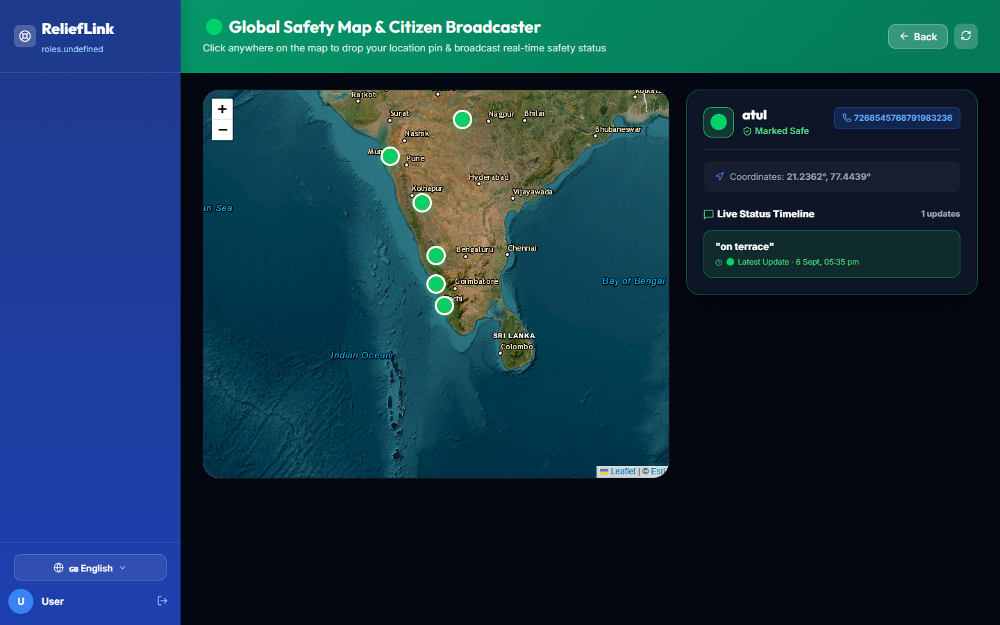
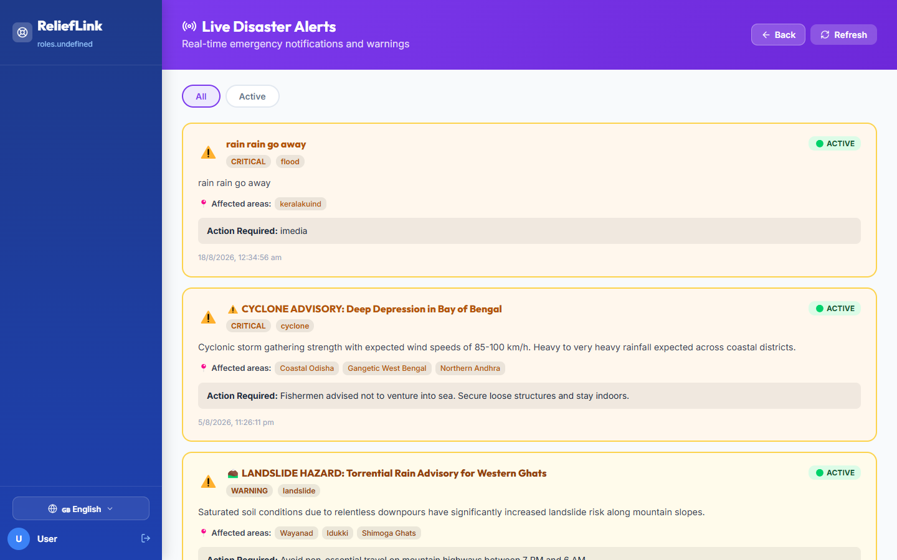
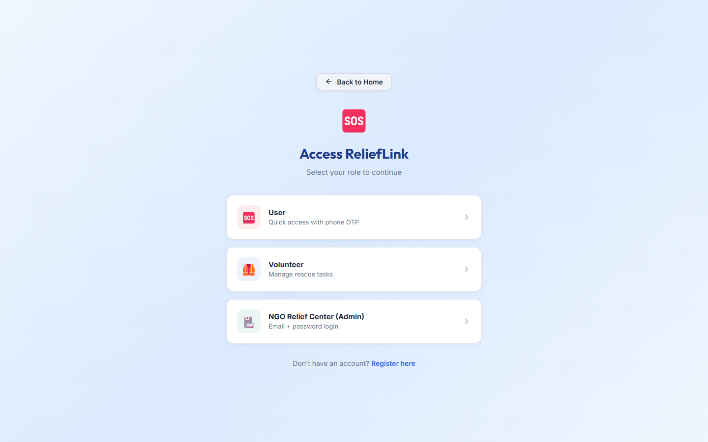
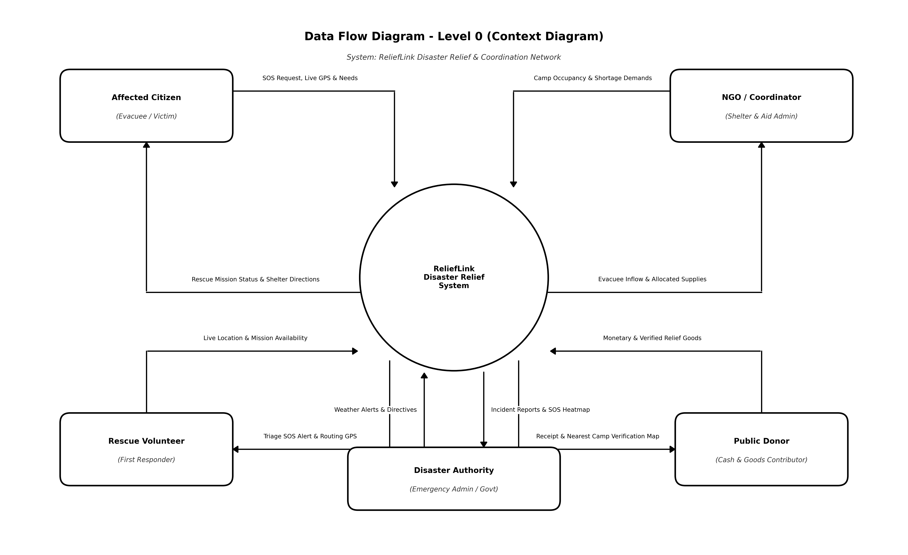
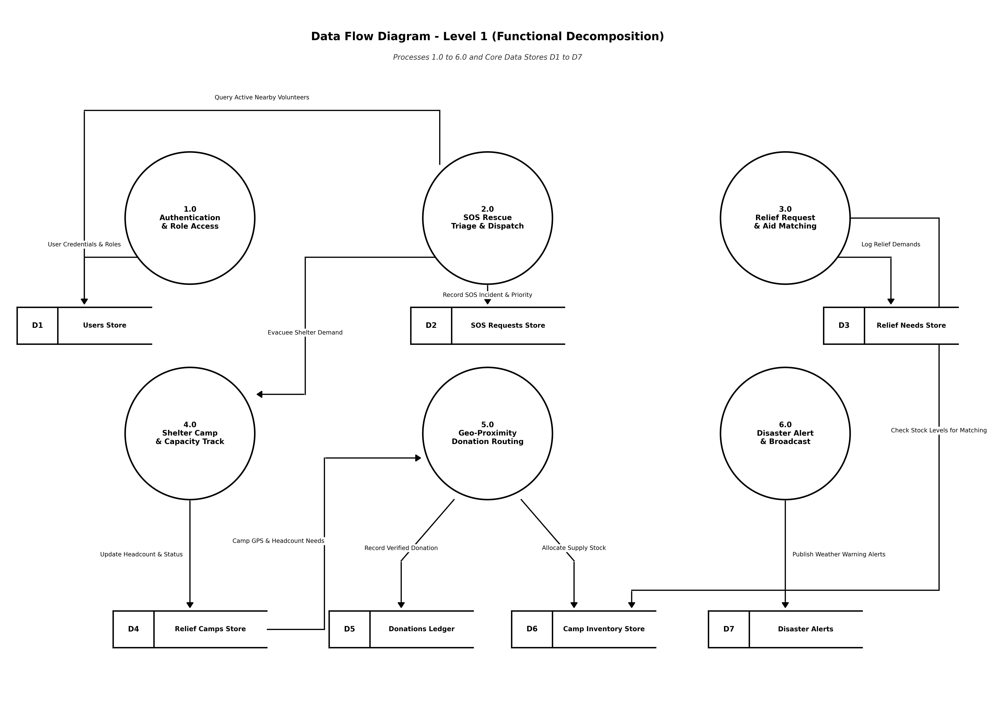
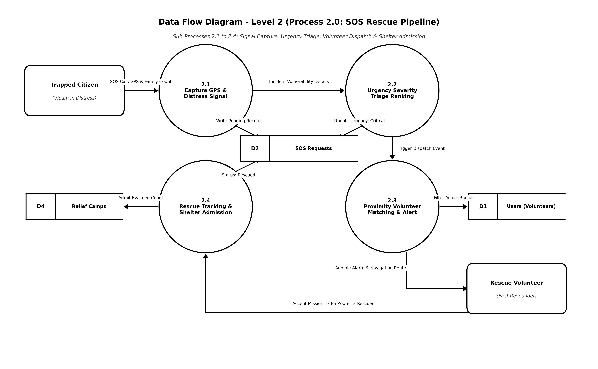
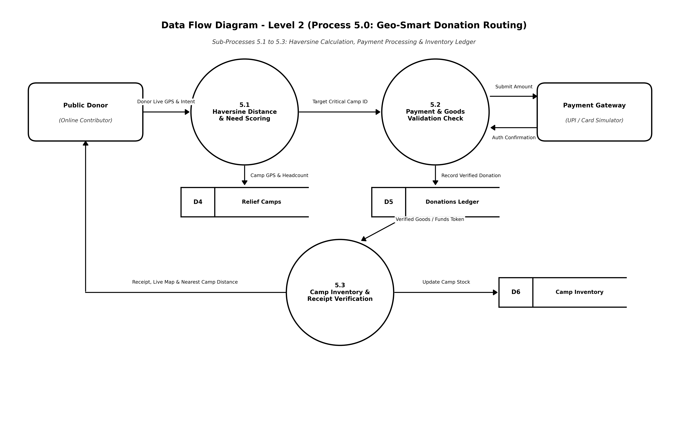

# ReliefLink 🌍🤝
### *Next-Generation Real-Time Disaster Response & Humanitarian Relief Coordination Platform*

[](https://vitejs.dev/)
[](https://reactjs.org/)
[](https://nodejs.org/)
[](https://expressjs.com/)
[](https://www.mongodb.com/)
[](https://socket.io/)
[](LICENSE)

---

## 📌 Overview

**ReliefLink** is an end-to-end, real-time humanitarian crisis management platform architected to eliminate critical communication delays during natural disasters. By bridging the gap between stranded citizens, first-responder volunteers, NGO relief centers, and government disaster cells, ReliefLink unifies rescue dispatch, camp logistics, and geo-smart donation distribution into an integrated operational command hub.

Traditional disaster relief often suffers from information silos, duplicate relief drop-offs, and critical supply mismatches. ReliefLink tackles these challenges with **sub-second WebSocket dispatching**, **Haversine geo-proximity donation routing**, **satellite GIS visual mapping**, and **multilingual accessibility**.

---

## 📸 Platform Showcase & Visual Walkthrough

### 1. 🌐 Interactive 3D Situational Command & Multilingual Hero
> High-performance WebGL 3D Earth visualization highlighting active disaster zones, real-time rescue corridors, and instantaneous access to emergency SOS tools. Features on-the-fly multilingual switching across **English**, **Malayalam (മലയാളം)**, and **Hindi (हिंदी)**.



---

### 2. 📦 Geo-Proximity Smart Supply Allocation (Haversine Router)
> Prevents supply waste and bottlenecking by analyzing live camp shortages and donor GPS coordinates. Automatically suggests the nearest critical shelter and enforces certified humanitarian relief item standards.



---

### 3. 🛰️ Satellite GIS Global Safety Broadcaster & Citizen Pin-Drop
> High-resolution satellite basemap powered by Leaflet & Esri GIS. Stranded citizens can pin their precise coordinates, update their immediate safety status (e.g., *"stranded on terrace"*), and broadcast directly to rescue teams.



---

### 4. ⚠️ Early Warning Radar & Live Disaster Weather Advisories
> Integrated environmental weather radar tracking meteorological warnings, IMD flood/cyclone alerts, and landslide advisories with urgency-tier classification.



---

### 5. 🔐 Segmented Multi-Role Access Control
> Low-friction authentication tailored for high-stress scenarios: instant phone number OTP for affected citizens, and secure JWT-based credentials for field volunteers and NGO camp administrators.



---

## 🏛️ System Architecture & Data Flow Diagrams (DFD)

ReliefLink's data architecture is documented in accordance with standard structural analysis principles, detailing external entities, core transactional processes, and persistence layers.

> 📄 **Complete Architecture Document:** Download the print-ready 4-page PDF specification: [ReliefLink_DFD_Documentation.pdf](docs/dfd/ReliefLink_DFD_Documentation.pdf)

### 📊 Level 0: Context Diagram
A high-level view showing system boundaries and data interactions across all four primary stakeholders.


---

### 📊 Level 1: System Processes & Data Stores
Detailed breakdown of the 6 core system processes (1.0 to 6.0) and 7 central data stores (D1 to D7).


---

### 📊 Level 2: Core Workflow Deep Dives

#### Process 2.0: Real-Time SOS Rescue Pipeline
Distress signal ingestion, urgency triage, proximity volunteer matching, and shelter admission.


#### Process 5.0: Geo-Smart Donation & Supply Routing
Haversine distance calculations, camp urgency ratios, payment gateway processing, and camp inventory crediting.


---

## 👥 Role-Based Capabilities

| Role | Access Method | Core Capabilities |
| :--- | :--- | :--- |
| **Affected Citizens** | Phone OTP (Instant) | • 1-Click GPS SOS Emergency Broadcast<br>• Humanitarian Aid Request (Food, Meds, Water)<br>• Interactive Relief Camp Locator<br>• Real-time Safe Status Pin-Drop on Map<br>• Localized Weather & Disaster Radar |
| **Volunteers** | Email & Password (JWT) | • Real-Time SOS Task Radar (Nearby Incidents)<br>• Turn-by-Turn GPS Rescue Navigation<br>• Aid Delivery Status Management<br>• Volunteer Skill Profile & Deployment History |
| **NGO Relief Centers** | Email & Password (JWT) | • Relief Camp Capacity & Shelter Occupancy Tracking<br>• Centralized Inventory Control (Auto-deductions)<br>• Review & Approval of Citizen Aid Requests<br>• Directed Geo-Proximity Donation Receipts |
| **District Admin** | Email & Password (JWT) | • High-Priority Disaster Broadcast System<br>• SOS Operations Triage & Resolution Logs<br>• User & Personnel Management<br>• Cross-District Relief Analytics & PDF Export |

---

## 💻 Tech Stack

### Frontend
- **Framework:** React 18 with Vite
- **Styling:** Custom CSS Design System with responsive grid, glassmorphism, and dark-mode accents
- **State Management:** Zustand
- **GIS & Mapping:** Leaflet.js, React-Leaflet, Esri World Imagery & OpenStreetMap tiles
- **3D Graphics:** Three.js / WebGL Earth Canvas
- **Internationalization (i18n):** Native multilingual context supporting English, Malayalam, and Hindi
- **Icons & UI:** Lucide-React, React Hot Toast

### Backend
- **Runtime:** Node.js (v18+) & Express.js
- **Real-Time Engine:** Socket.io (WebSocket channels for instantaneous dispatch & live broadcasts)
- **Database:** MongoDB Atlas via Mongoose ODM
- **Authentication:** JWT (JSON Web Tokens) & Phone OTP verification engine
- **GIS & Math:** Haversine Great-Circle Distance Algorithm for geo-matching
- **Integrations:** OpenWeatherMap API, Web Push VAPID notifications

---

## 📁 Repository Structure

```text
Relieflink1/
├── backend/
│   ├── config/             # Database connection & socket configuration
│   ├── controllers/        # Request handling logic (SOS, Camps, Donations, Auth)
│   ├── middleware/         # Auth verification, role guards & error handlers
│   ├── models/             # Mongoose schemas (User, SOS, Camp, Donation, Alert)
│   ├── routes/             # RESTful API route definitions
│   ├── seeders/            # Database seed scripts with live camp data
│   └── server.js           # Server entry point & WebSocket bootstrap
├── frontend/
│   ├── public/             # Static assets, manifests & service workers
│   ├── src/
│   │   ├── api/            # Axios API client & interceptors
│   │   ├── components/     # Reusable UI widgets, maps & navigation
│   │   ├── context/        # Multilingual LanguageContext (i18n)
│   │   ├── pages/          # Role-based views (Affected, Volunteer, NGO, Admin)
│   │   ├── store/          # Zustand global state stores
│   │   ├── translations/   # English, Malayalam, and Hindi locale files
│   │   └── App.jsx         # App router & socket event listeners
│   └── vite.config.js      # Vite build configuration with API reverse proxy
└── docs/
    ├── dfd/                # Architectural diagrams (Level 0, 1, 2) & PDF doc
    └── screenshots/        # High-resolution platform UI captures
```

---

## 🚀 Quickstart & Local Setup Guide

### Prerequisites
- **Node.js**: v18.x or higher installed ([Download Node.js](https://nodejs.org/))
- **MongoDB**: Active MongoDB Atlas cluster URI or local MongoDB instance running on `mongodb://localhost:27017`
- **Git**: Installed on your operating system

### 1. Clone the Repository
```bash
git clone https://github.com/Vivek-k001/Relieflink1.git
cd Relieflink1
```

### 2. Backend Setup
```bash
cd backend
npm install
```

Create a `.env` file in the `backend/` directory:
```env
PORT=5000
NODE_ENV=development
MONGO_URI=your_mongodb_connection_string
JWT_SECRET=your_jwt_secret_key
JWT_EXPIRES_IN=7d
OTP_EXPIRY_MINUTES=10
OPENWEATHER_API_KEY=your_openweathermap_api_key
FRONTEND_URL=http://localhost:5173
```

Seed initial relief camps and admin records:
```bash
node seeders/campSeeder.js
```

Start the backend API server:
```bash
npm run dev
# Running at http://localhost:5000
```

### 3. Frontend Setup
Open a new terminal window:
```bash
cd frontend
npm install
npm run dev
# Running at http://localhost:5173 (or https://localhost:5173 with SSL)
```

The Vite dev server automatically proxies `/api` and `/socket.io` requests directly to `http://localhost:5000`.

---

## 🌐 API Endpoints Reference

| Method | Route | Description | Auth Required |
| :--- | :--- | :--- | :--- |
| `POST` | `/api/auth/otp/request` | Send OTP to mobile phone | No |
| `POST` | `/api/auth/otp/verify` | Verify OTP & issue citizen token | No |
| `POST` | `/api/auth/login` | Email/Password login (Volunteer/NGO/Admin) | No |
| `POST` | `/api/sos` | Create emergency GPS SOS distress signal | Yes (Citizen) |
| `GET` | `/api/sos/nearby` | Fetch active SOS alerts within volunteer radius | Yes (Volunteer) |
| `PATCH` | `/api/sos/:id/status` | Update rescue status (Dispatched, Rescued) | Yes (Volunteer/Admin) |
| `GET` | `/api/camps` | Fetch all relief camps with capacity metrics | No |
| `POST` | `/api/donations` | Submit monetary or supply donation with camp routing | No |
| `GET` | `/api/alerts` | Fetch active disaster warnings & weather advisories | No |
| `POST` | `/api/alerts/broadcast` | Broadcast emergency alert system-wide | Yes (Admin) |

---

## 📄 License

Distributed under the **MIT License**. See `LICENSE` for more information.

---

<div align="center">
  <sub>Built with ❤️ for rapid humanitarian response and life-saving disaster coordination.</sub>
</div>
