# ReliefLink 🌍🤝
### *Next-Generation Real-Time Disaster Response & Humanitarian Relief Coordination Platform*

[](https://vitejs.dev/)
[](https://reactjs.org/)
[](https://nodejs.org/)
[](https://expressjs.com/)
[](https://www.mongodb.com/)
[](https://socket.io/)
[](LICENSE)

---

## 📌 Overview

**ReliefLink** is an end-to-end, real-time humanitarian crisis management platform architected to eliminate critical communication delays during natural disasters. By bridging the gap between stranded citizens, first-responder volunteers, and NGO relief command centers, ReliefLink unifies rescue dispatch, camp logistics, and geo-smart donation distribution into an integrated operational command hub.

Traditional disaster relief often suffers from information silos, duplicate relief drop-offs, and critical supply mismatches. ReliefLink tackles these challenges with **sub-second WebSocket dispatching**, **Haversine geo-proximity donation routing**, **satellite GIS visual mapping**, and **multilingual accessibility**.

---

## 📸 Platform Showcase & Visual Walkthrough

### 1. 🌐 Interactive Situational Command & Multilingual Hero
> WebGL 3D Earth visualization highlighting active disaster zones, real-time rescue corridors, and instantaneous access to emergency SOS tools. Features on-the-fly multilingual switching across **English**, **Malayalam (മലയാളം)**, and **Hindi (हिंदी)**.

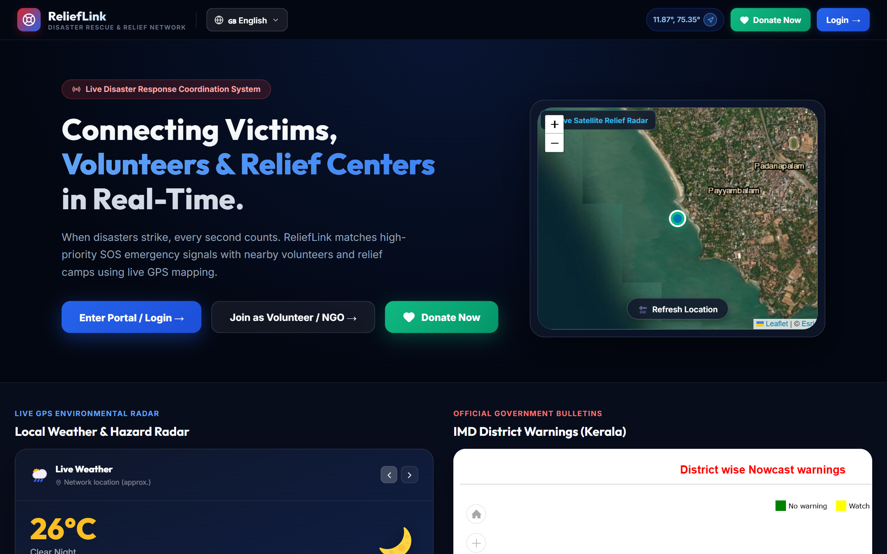

---

### 2. 🔐 Segmented Multi-Role Access Control Portal
> Low-friction authentication tailored for high-stress disaster scenarios: **Instant 6-digit phone OTP** for citizens in need (zero password barriers), and secure credential-based access for registered emergency responders.

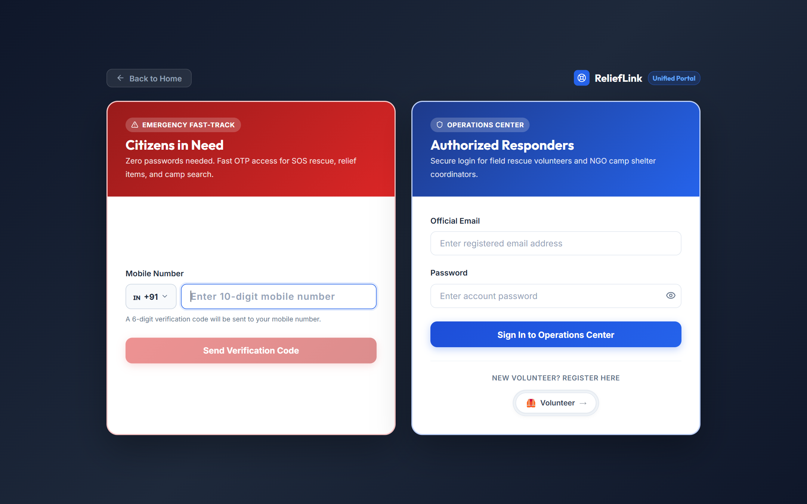

---

### 3. 🏢 NGO Operations & Command Headquarters
> The operational command cockpit for disaster coordinators: Live incident counters, real-time SOS triage queue, relief camp bed occupancy tracking, automated inventory monitors, and volunteer deployment rosters.

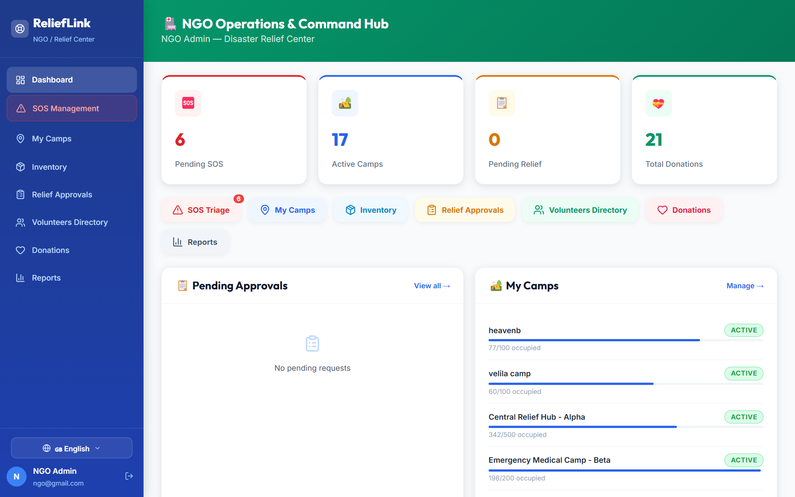

---

### 4. 🏕️ Relief Camp Shelter & Occupancy Management
> Real-time GIS camp monitoring displaying live bed capacity vs occupancy ratios, operational status, and available essential amenities (Medical bay, Cooked meals, Drinking water, Sleeping quarters).

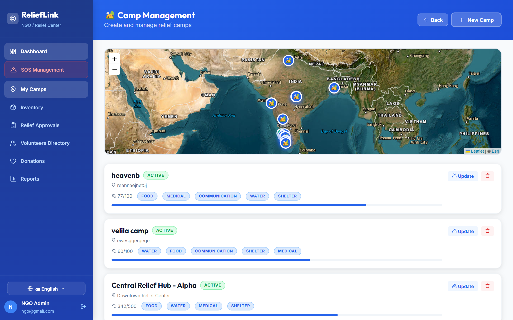

---

### 5. ⛑️ Volunteer Field Response Hub & Live Rescue Radar
> First-responder mobile & web interface featuring nearby emergency radar feed, turn-by-turn routing navigation, victim phone contact, and mission progression (*En Route ➔ Arrived on Scene ➔ Rescued*).

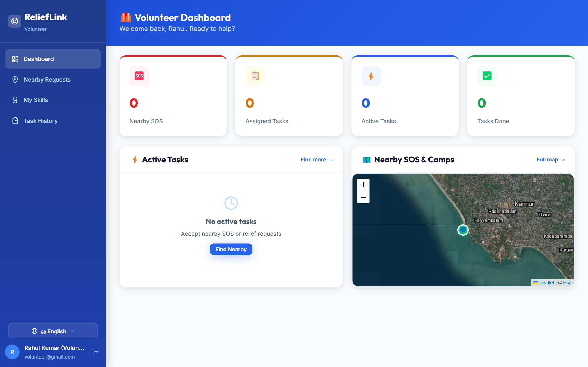

---

### 6. 📱 Affected Citizen Emergency SOS & Relief Hub
> Zero-friction citizen portal equipped with one-tap emergency SOS broadcast, humanitarian supply requests (Food, Water, Medical, Blankets), live nearest camp distance locator, and active rescuer tracking.

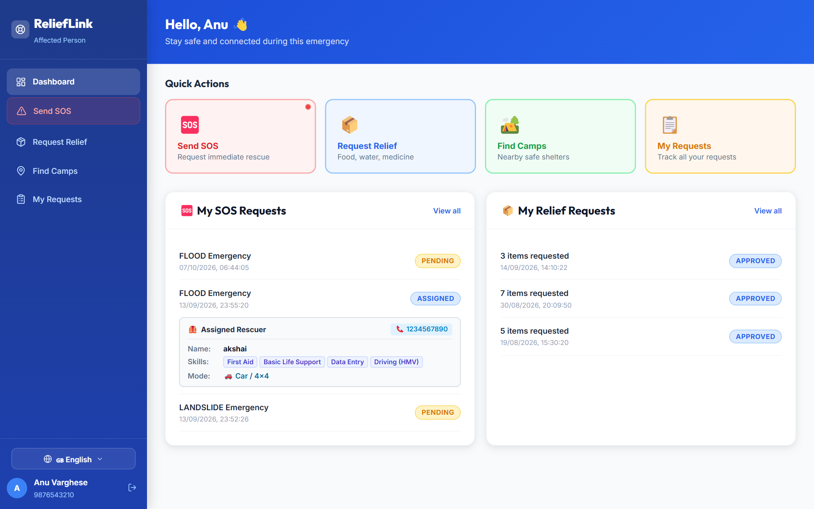

---

### 7. 🆘 High-Priority Emergency SOS Distress Dispatch
> Captures real-time device GPS coordinates, disaster category (Flood, Landslide, Earthquake), priority urgency tier, and trapped victim count with sub-second WebSocket transmission to all active responders.

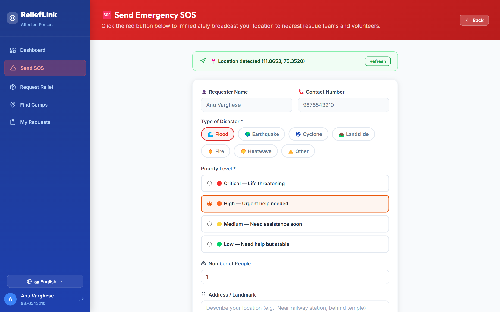

---

### 8. 🛰️ Satellite GIS Global Safety Broadcaster & Citizen Pin-Drop
> High-resolution satellite basemap powered by Leaflet & Esri GIS. Citizens can pin their precise coordinates, update their immediate safety status (e.g., *"stranded on terrace"*), and broadcast directly to rescue teams.

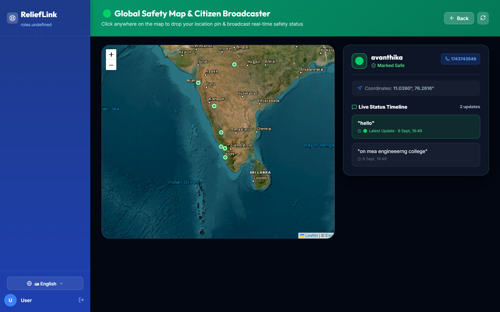

---

### 9. 📦 Geo-Proximity Smart Supply Allocation (Haversine Router)
> Prevents supply waste and bottlenecking by analyzing live camp shortages and donor GPS coordinates. Automatically suggests the nearest critical shelter and enforces certified humanitarian relief item standards.

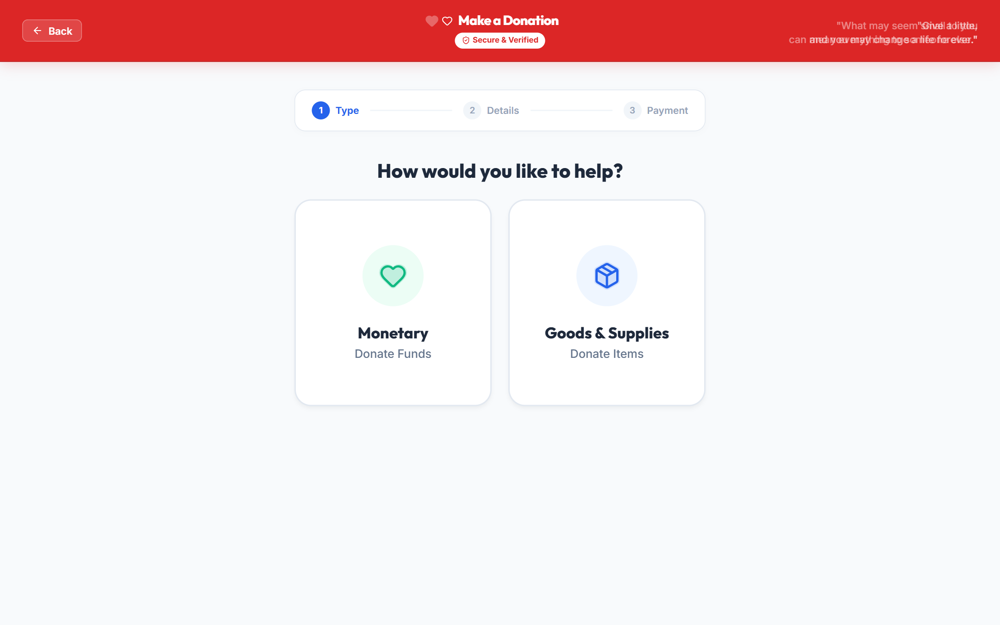

---

### 10. ⚠️ Early Warning Radar & Live Disaster Weather Advisories
> Integrated environmental weather radar tracking meteorological warnings, IMD flood/cyclone alerts, and landslide advisories with urgency-tier classification.

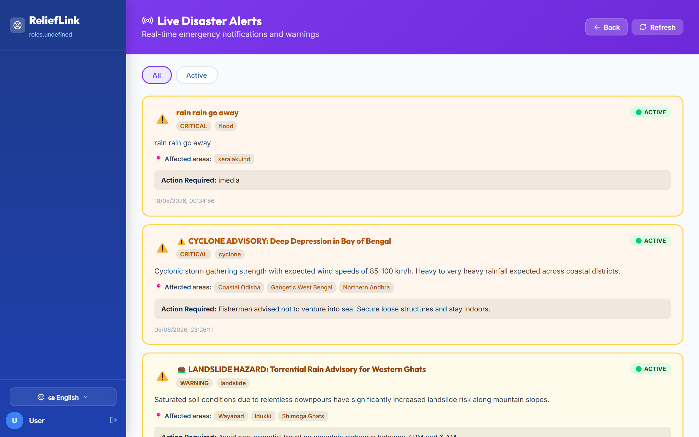

---

### 11. 👥 Centralized Missing Persons Directory & Reunification
> Public and responder directory allowing families to search, filter by relief camp status, and report missing individuals with vital physical details and emergency contact information.

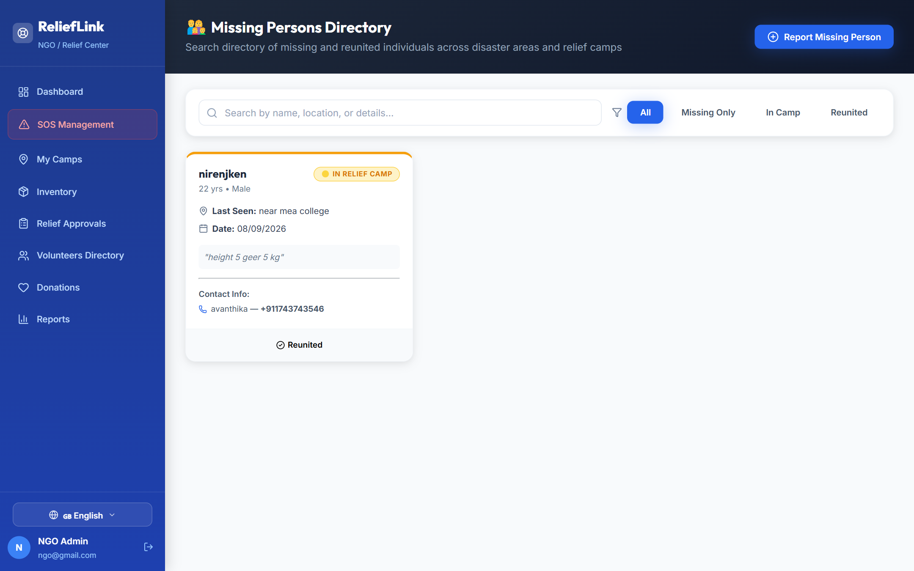

---

## 👥 Role-Based Architecture (3 Official Scrum Modules)

| Role | Access Method | Target Dashboard | Core Capabilities |
| :--- | :--- | :--- | :--- |
| **📱 Affected Citizens (`affected`)** | Mobile Phone + OTP | `/dashboard` | • 1-Click GPS SOS Emergency Broadcast<br>• Humanitarian Aid Request (Food, Meds, Water)<br>• Interactive Relief Camp Locator & Directions<br>• Real-time Safe Status Pin-Drop on Map<br>• Track Assigned Rescuer & Status Updates |
| **⛑️ Field Volunteers (`volunteer`)** | Email & Password | `/volunteer` | • Real-Time Nearby SOS Emergency Radar<br>• One-Tap Rescue Mission Acceptance<br>• Turn-by-Turn GPS Rescue Navigation<br>• Aid Delivery & Mission Status Progression<br>• Skill Profiles (First Aid, 4x4 Driving, SAR) |
| **🏢 NGO Relief Centers (`ngo`)** | Email & Password | `/ngo` | • Centralized Live SOS Triage & Responder Dispatch<br>• System-Wide Red/Orange/Yellow Alert Broadcasting<br>• Relief Camp Shelter Capacity & Bed Occupancy Control<br>• Real-Time Inventory Tracking & Low-Stock Alerts<br>• Review & Approval of Citizen Aid Requests<br>• Volunteer Registry & Mission Coordination |

### 🔑 Demo Test Credentials (Pre-seeded)

```text
- 🏢 NGO Command Center:  ngo@gmail.com       / ngo@123
- ⛑️ Field Volunteer:     volunteer@gmail.com / volunteer@123
- 📱 Affected Citizen:    Phone: 9876543210   / OTP: 123456
```

---

## 🏛️ System Architecture & Visual Diagrams

### 🗺️ UML Use Case Diagram (3-Role System Boundary)
Complete actor-to-process interaction map showing citizen, volunteer, and relief administrator interactions.

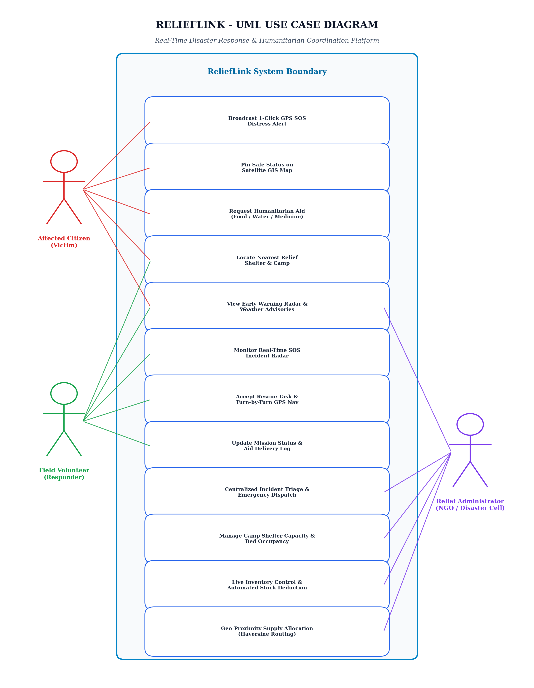

---

### 📊 Data Flow Diagrams (DFD)

> 📄 **Complete Architecture Document:** Download the print-ready 4-page PDF specification: [ReliefLink_DFD_Documentation.pdf](docs/dfd/ReliefLink_DFD_Documentation.pdf)

#### Level 0: Context Diagram
A high-level view showing system boundaries and data interactions across all primary stakeholders.
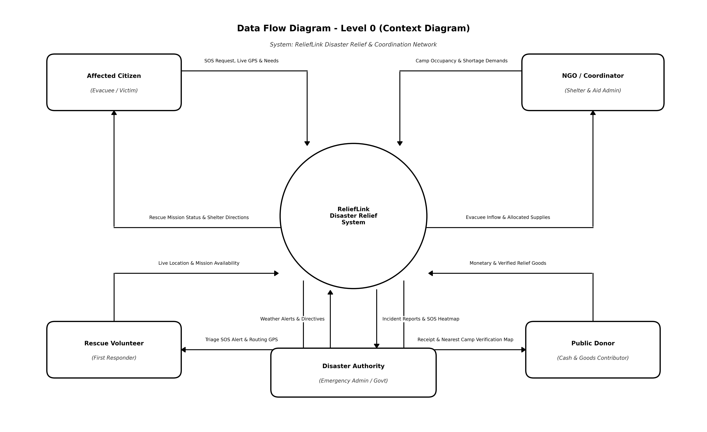

#### Level 1: System Processes & Data Stores
Detailed breakdown of the 6 core system processes (1.0 to 6.0) and 7 central data stores (D1 to D7).
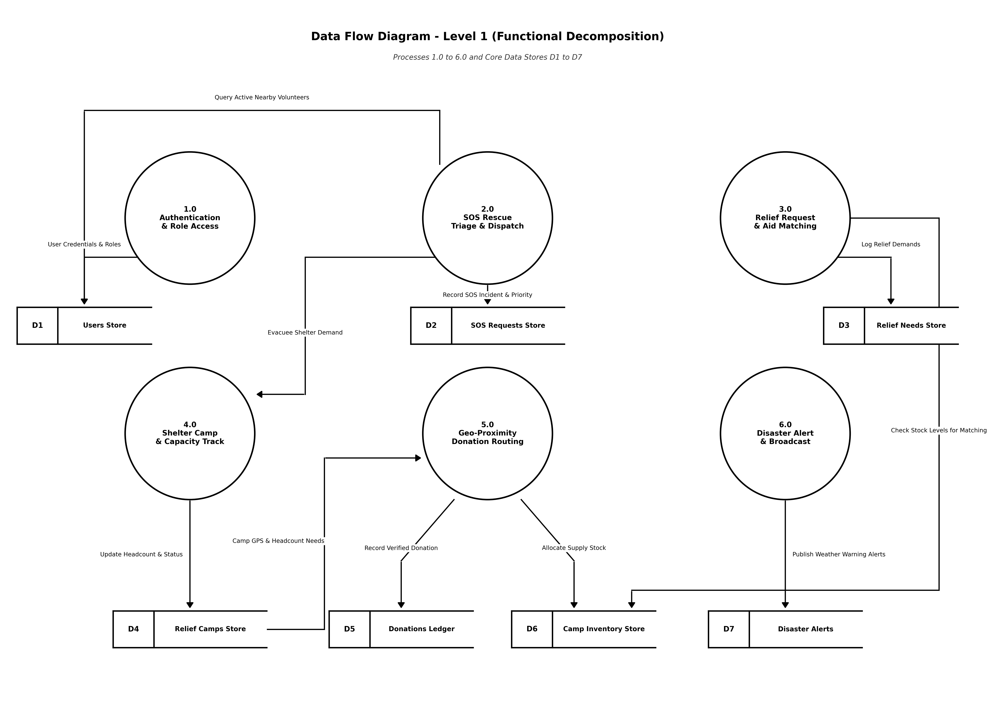

#### Level 2: Core Workflow Deep Dives
* **Process 2.0: Real-Time SOS Rescue Pipeline:**
  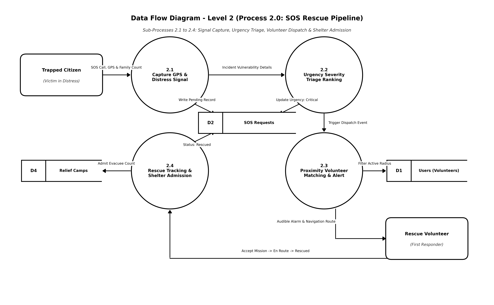
* **Process 5.0: Geo-Smart Donation & Supply Routing:**
  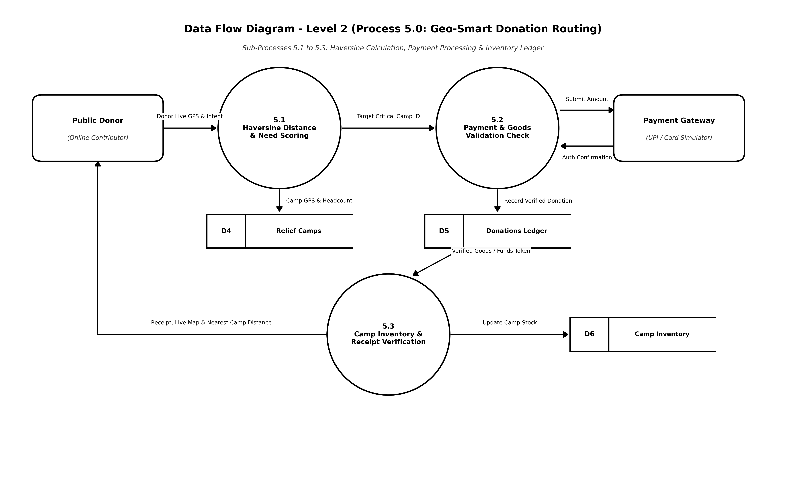

---

### 🗄️ Database Schemas (MongoDB Atlas)

ReliefLink uses normalized, geo-indexed schemas in MongoDB:

| Entity | Schema Overview |
| :--- | :--- |
| **Users (`users`)** | Authentication, roles (`affected`, `volunteer`, `ngo`), skills, and 2dsphere GeoJSON location.<br>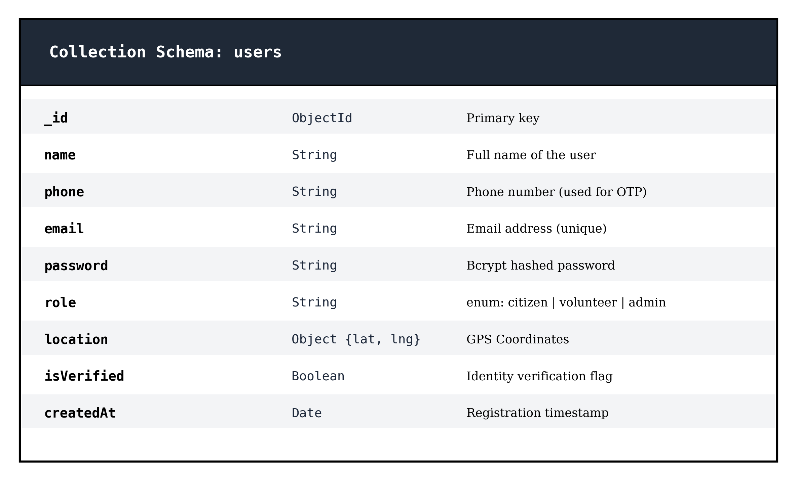 |
| **SOS Requests (`sos_requests`)** | Distress signals, urgency tiers, trapped count, medical notes, and assigned rescuer ref.<br>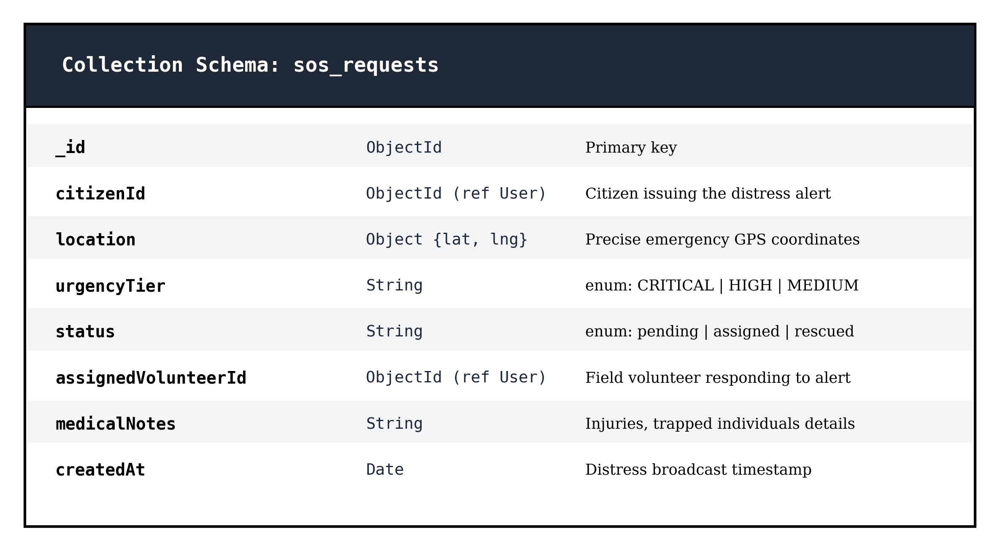 |
| **Relief Camps (`relief_camps`)** | Shelter capacity, live occupancy, manager ref, facilities, and geo-coordinates.<br>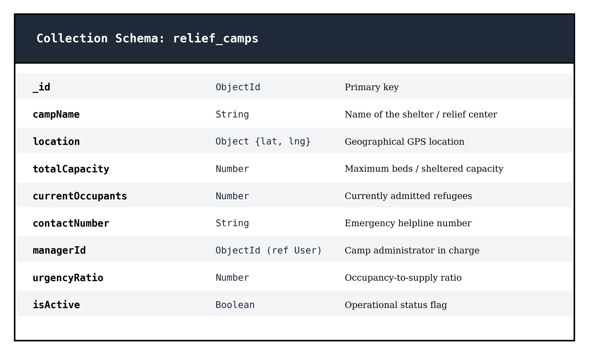 |
| **Inventory (`inventories`)** | Camp supply items, quantities, units, and minimum stock threshold alert levels.<br>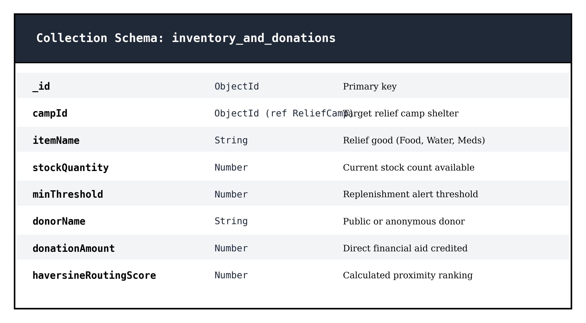 |
| **Aid Requests (`relief_requests`)** | Citizen humanitarian supply requirements, quantities, approval status, and timestamps.<br>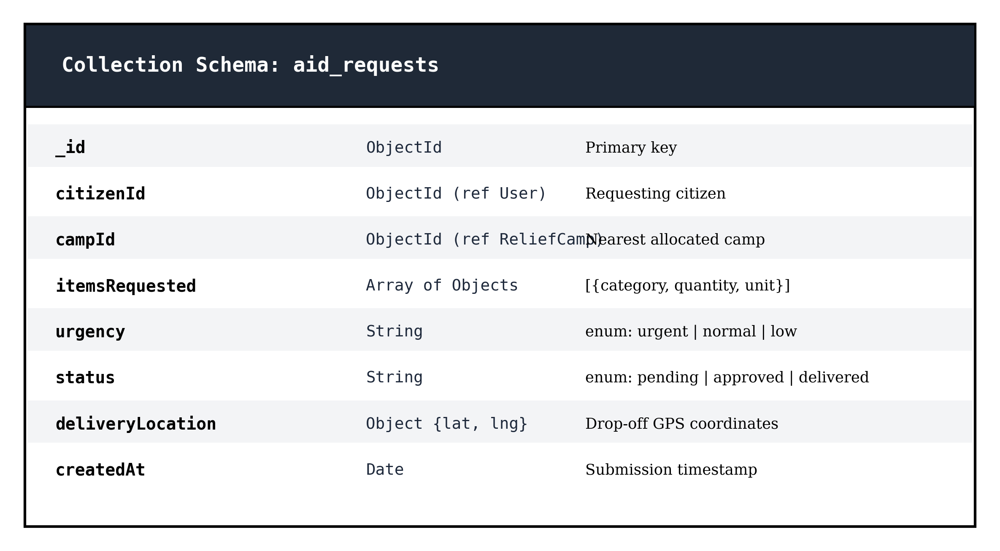 |

---

## 💻 Tech Stack

### Frontend
- **Framework:** React 18 with Vite
- **Styling:** Custom CSS Design System with responsive grid, glassmorphism, and dark-mode accents
- **State Management:** Zustand with local persistence
- **GIS & Mapping:** Leaflet.js, React-Leaflet, Esri World Imagery & OpenStreetMap tiles
- **3D Graphics:** Three.js / WebGL Earth Canvas
- **Internationalization (i18n):** Native multilingual context supporting English, Malayalam (മലയാളം), and Hindi (हिंदी)
- **Icons & UI:** Lucide-React, React Hot Toast

### Backend
- **Runtime:** Node.js (v18+) & Express.js
- **Real-Time Engine:** Socket.io (WebSocket channels for instantaneous dispatch & live broadcasts)
- **Database:** MongoDB Atlas via Mongoose ODM
- **Network Resilience:** Built-in public DNS resolution fallback (`8.8.8.8`, `8.8.4.4`, `1.1.1.1`) to ensure zero-failure Atlas SRV lookups across restricted or ISP-throttled networks.
- **Authentication:** JWT (JSON Web Tokens) & Phone OTP verification engine
- **GIS & Math:** Haversine Great-Circle Distance Algorithm for geo-matching
- **Integrations:** OpenWeatherMap API, Web Push VAPID notifications

---

## 🚀 Quickstart & Setup Guide

### 1. Clone & Install Dependencies

```bash
git clone https://github.com/Vivek-k001/Relieflink1.git
cd Relieflink1

# Install dependencies for both backend and frontend in one step
npm run setup
```

### 2. Environment Configuration

Create a `.env` file in the `backend/` directory (you can copy from `backend/.env.example`):

```env
PORT=5000
NODE_ENV=development
MONGO_URI=mongodb+srv://<username>:<password>@cluster0.mongodb.net/relieflink?retryWrites=true&w=majority
JWT_SECRET=relieflink_secret_key_2026
JWT_EXPIRES_IN=7d
```

### 3. Seed Database with Demo Data

Populate the database with sample camps, volunteers, inventory items, and alerts:

```bash
npm run seed
```

### 4. Run Development Servers

Launch both backend (`http://localhost:5000`) and frontend (`https://localhost:5173`) concurrently:

```bash
npm run dev
```

---

## 🌐 API Endpoints Reference

| Method | Route | Description | Auth Required |
| :--- | :--- | :--- | :--- |
| `POST` | `/api/auth/send-otp` | Send 6-digit OTP to mobile phone | No |
| `POST` | `/api/auth/verify-otp` | Verify OTP & issue citizen session token | No |
| `POST` | `/api/auth/login` | Official Email/Password login (Volunteer & NGO) | No |
| `POST` | `/api/auth/register` | Register new Volunteer or NGO | No |
| `POST` | `/api/sos` | Create emergency GPS SOS distress signal | Yes (Citizen) |
| `GET` | `/api/sos/nearby` | Fetch active SOS alerts within volunteer radius | Yes (Volunteer) |
| `PATCH` | `/api/sos/:id/status` | Update rescue status (*Assigned*, *Rescued*) | Yes (Volunteer/NGO) |
| `GET` | `/api/camps` | Fetch all relief camps with capacity metrics | No |
| `POST` | `/api/camps` | Register new relief camp shelter | Yes (NGO) |
| `GET` | `/api/inventory/:campId` | Get live supplies inventory for a relief camp | Yes (NGO) |
| `POST` | `/api/donations` | Submit monetary or supply donation with geo-routing | No |
| `GET` | `/api/alerts` | Fetch active disaster warnings & weather advisories | No |
| `POST` | `/api/alerts/broadcast` | Broadcast emergency alert system-wide | Yes (NGO) |
| `GET` | `/api/missing-persons` | List and search missing individuals | Yes (All) |

---

## 📁 Repository Structure

```text
Relieflink1/
├── backend/
│   ├── config/             # DB connection (with 8.8.8.8 DNS fallback) & socket bootstrap
│   ├── controllers/        # Business logic (SOS, Camps, Donations, Auth, Inventory)
│   ├── middleware/         # Auth verification, role guards & error handlers
│   ├── models/             # Mongoose schemas (User, SOS, Camp, Donation, Alert, Inventory)
│   ├── routes/             # RESTful API route definitions
│   ├── seedAll.js          # Master seed script for demo accounts & operational data
│   └── server.js           # Server bootstrap & WebSocket engine
├── frontend/
│   ├── public/             # Static assets, manifests & service workers
│   ├── src/
│   │   ├── api/            # Axios API client & interceptors
│   │   ├── components/     # Reusable UI widgets, Leaflet maps & navigation bars
│   │   ├── context/        # Multilingual LanguageContext (English, Malayalam, Hindi)
│   │   ├── pages/          # 3-Role interfaces (Affected, Volunteer, NGO)
│   │   ├── store/          # Zustand global state stores with persistent auth
│   │   └── App.jsx         # App router, role guards & Socket.io listeners
│   └── vite.config.js      # Vite build configuration with API reverse proxy
├── scripts/
│   └── capture_real_screenshots.js # Automated browser screenshot generator
└── docs/
    ├── dfd/                # Architectural diagrams (Level 0, 1, 2) & PDF specifications
    ├── schema_*.png        # MongoDB collection schema diagrams
    └── screenshots/        # High-resolution live platform UI captures
```

---

## 📄 License

Distributed under the **MIT License**. See `LICENSE` for more information.

---

<div align="center">
  <sub>Built with ❤️ for rapid humanitarian response, life-saving rescue dispatch, and disaster relief coordination.</sub>
</div>
