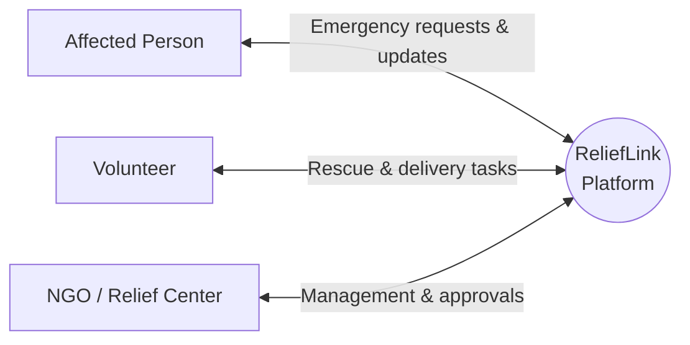
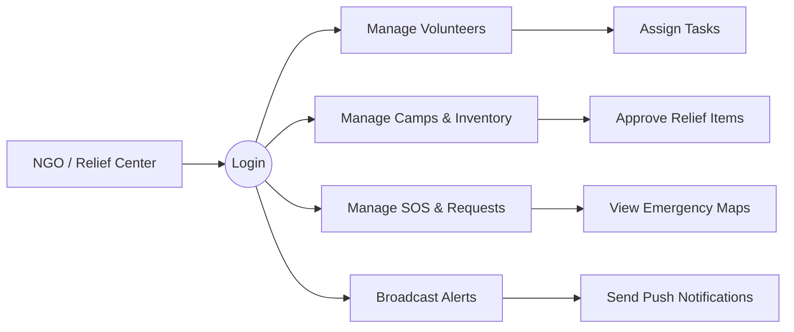
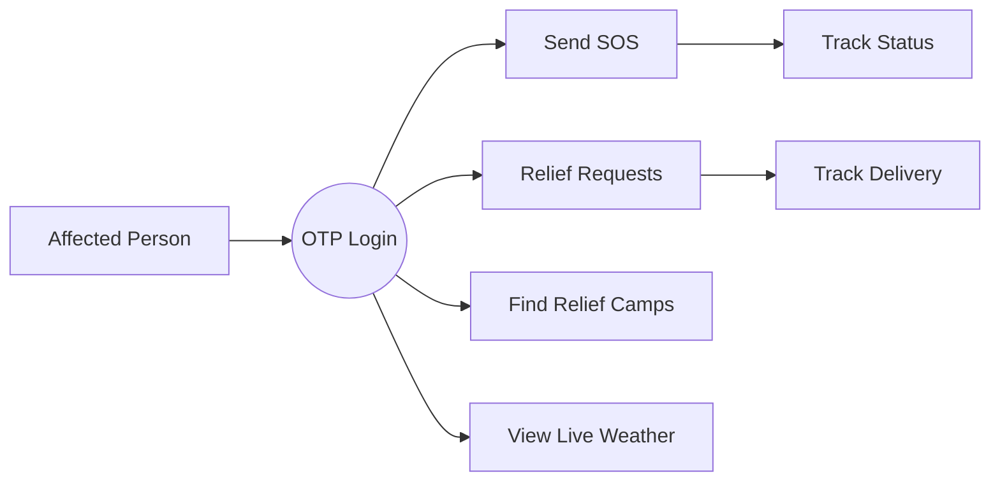
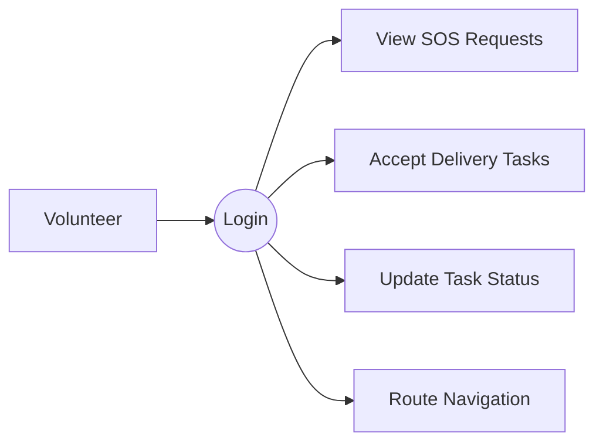

# ReliefLink1 Scrum Backlog & System Diagrams

## 1. System Architecture & DFD (Mermaid Diagrams)

Based on your reference diagrams, here are the equivalent flow diagrams for ReliefLink1 mapping the user roles to their respective functionalities.

### 1.1 Context Diagram (Level 0)

### 1.2 NGO / Relief Center Flow

### 1.3 Affected Person Flow

### 1.4 Volunteer Flow

---

## 2. Scrum Product Backlog (Epics & User Stories)

### Epic 1: Authentication & User Management
* **User Story 1.1:** As an Affected Person, I want to log in using an OTP sent to my phone number so that I can quickly access the system during an emergency.
* **User Story 1.2:** As a Volunteer, I want to register and log in with my email so that I can set up my profile and list my skills.
* **User Story 1.3:** As an NGO admin, I want to log in with secure credentials so that I can manage the dashboard and relief efforts.

### Epic 2: Emergency Response & SOS
* **User Story 2.1:** As an Affected Person, I want a quick way to send an SOS alert with my location so that rescuers can find me.
* **User Story 2.2:** As an Affected Person, I want to mark myself as "Safe" so my family and responders know I am no longer in danger.
* **User Story 2.3:** As an NGO admin, I want to see all SOS requests on a map so that I can assign nearby volunteers effectively.

### Epic 3: Relief Requests & Volunteer Tasks
* **User Story 3.1:** As an Affected Person, I want to request specific relief items (food, water, medicine) so my needs are met.
* **User Story 3.2:** As an NGO admin, I want to approve and manage relief requests so that I can allocate inventory properly.
* **User Story 3.3:** As a Volunteer, I want to view active relief requests and SOS calls so I can accept tasks.
* **User Story 3.4:** As a Volunteer, I want to update my task status (e.g., "En Route", "Delivered") so the NGO and affected person know the progress.

### Epic 4: Camp & Inventory Management
* **User Story 4.1:** As an NGO admin, I want to add and update details of relief camps so affected people can locate them.
* **User Story 4.2:** As an NGO admin, I want to track available inventory at each camp to prevent shortages.
* **User Story 4.3:** As an Affected Person, I want to use a camp finder tool to locate the nearest safe shelter.

### Epic 5: Alerts & Navigation
* **User Story 5.1:** As a Volunteer, I want to use route navigation to find the fastest way to a delivery or rescue point.
* **User Story 5.2:** As an Affected Person, I want to see live weather updates and disaster alerts so I can stay safe.
* **User Story 5.3:** As an NGO admin, I want to broadcast disaster alerts to all users in a specific region.
